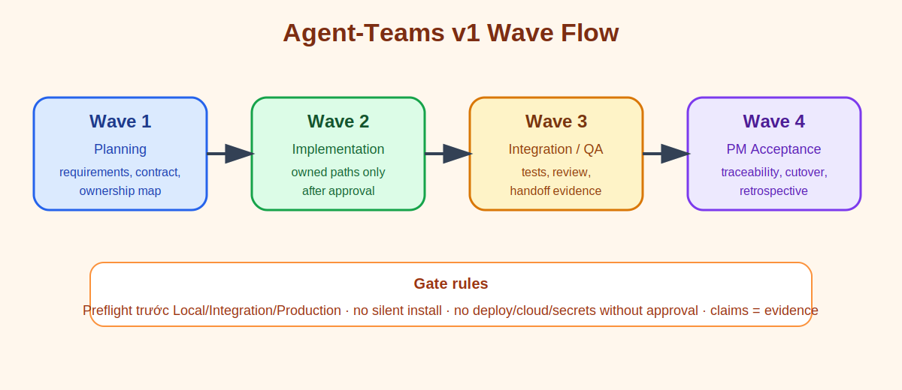
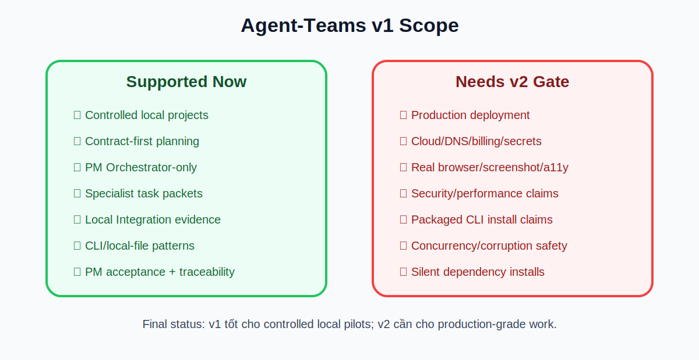

# Agent-Teams Overview Report

## 1. Agent-Teams Là Gì?

Agent-Teams là hệ thống điều phối nhiều specialist agents dưới một PM Orchestrator.

Mục tiêu: biến một yêu cầu phần mềm thành luồng làm việc có phân vai, có gate, có evidence, có acceptance rõ ràng.


## 2. Tư Tưởng Thiết Kế

Agent-Teams không để một agent làm hết mọi việc. PM Agent chỉ điều phối, không tự đóng vai developer/tester/reviewer.

```text
PM Agent = Orchestrator-only
Specialist agents = người làm chuyên môn
Evidence = bằng chứng để được claim
Gates = điểm dừng để kiểm soát rủi ro
Acceptance = quyết định cuối dựa trên traceability
```

## 3. Các Nhóm Agent Chính

### PM / Orchestrator

- nhận yêu cầu
- xác định scope
- chia phase/wave
- giao task packet
- kiểm evidence
- quyết acceptance/reject

### Planning / Design

- Requirements Agent
- UX/Design Agent
- Technical Architecture Agent
- API/Contract Agent

### Implementation

- Frontend Agent
- Backend Agent
- Integration Agent
- QA/Test Agent

### Review / Production Readiness

- Security Review Agent
- Performance Review Agent
- Code Review Agent
- DevOps/Deployment Agent
- Documentation Agent
- Challenge Agent

## 4. Luồng Làm Việc v1

Agent-Teams v1 dùng 4 waves chính.



### Wave 1 — Planning / Contract / Ownership

Mục tiêu: hiểu đúng việc trước khi code.

Output thường có:

```text
requirements.md
acceptance-criteria.md
architecture.md
feature-contract.md
ownership-map.md
wave-1-verification-report.md
```

### Wave 2 — Implementation

Mục tiêu: implement trong owned paths đã được duyệt.

Điều kiện:

```text
Wave 1 accepted
user approved Wave 2
preflight passed or blocker documented
no silent install
no deploy/cloud/secrets
```

### Wave 3 — Integration / QA / Review

Mục tiêu: xác minh bằng command thật, test thật, review thật.

Output thường có:

```text
test.log
build.log
integration-report.md
qa-report.md
code-review.md
challenge-review.md
handoff.md
wave-3-verification-report.md
```

### Wave 4 — PM Acceptance

Mục tiêu: quyết định accept/reject dựa trên evidence.

Output thường có:

```text
pm-acceptance-report.md
requirements-traceability-matrix.md
cutover-decision.md
retrospective.md
final-verification-report.md
```

## 5. Scope v1

Agent-Teams v1 đã được validate cho controlled local pilots.



## 6. Điểm Mạnh Hiện Tại

```text
PM Agent giữ đúng vai trò Orchestrator-only
Specialist agents có phạm vi rõ
Runbook và checklist đủ để lặp lại
Starter packet giúp bắt đầu project mới nhanh
Contract-first giảm lệch yêu cầu
Preflight giảm claim sai khi thiếu tool/dependency
Evidence reports giúp audit lại quyết định
Challenge review giúp chặn overclaim
```

## 7. Guardrails Quan Trọng

```text
No silent installs/downloads
No deploy/cloud/DNS/billing/secrets without explicit approval
Preflight required before Local/Integration/Production claims
No real browser/screenshot/a11y/visual claim without executable launch evidence
No security/performance claim without specialist evidence
No production claim without production gate
Claims must match evidence
```

## 8. Evidence Đã Có

### Pilot 1 — mini-issue-tracker-v1

```text
Status: accepted for controlled local pilot
Type: local HTTP API/UI pilot
Evidence: local integration tests, PM acceptance, traceability, retrospective
```

### Pilot 2 — local-bookmarks-cli-v1

```text
Status: accepted for controlled local pilot
Type: dependency-free Node CLI/local-file pilot
Tests: 6 tests, 6 pass, 0 fail
Evidence: implementation report, integration/QA/review reports, PM acceptance
```

## 9. Cách Dùng Cho Project Mới

```text
1. Mở systems/agent-teams/runbooks/new-local-project-launch-runbook.md
2. Copy systems/agent-teams/templates/v1-local-project-starter/
3. Điền intake/requirements/acceptance/architecture/contract/ownership
4. Chạy Wave 1 và dừng để duyệt
5. Sau khi user duyệt, chạy Wave 2 implementation
6. Chạy Wave 3 Integration/QA/review
7. Chạy Wave 4 PM acceptance
8. Commit/push only scoped files
```

## 10. Khi Nào Nên Dùng Agent-Teams v1?

Nên dùng khi:

```text
project nhỏ hoặc vừa
local-only
cần phân vai rõ
cần evidence trước khi claim done
cần PM điều phối specialist agents
cần kiểm soát scope và rollback
```

Không nên dùng v1 nếu chưa thêm gate mới:

```text
production deployment
cloud infrastructure
secrets/billing/DNS
real browser visual/a11y proof
security-critical release
performance-critical release
multi-user concurrency-critical system
```

## 11. Roadmap v2

v2 nên mở rộng theo hướng:

```text
1. Dependency/toolchain governance
2. Browser/UI evidence recovery
3. Security/performance evidence gates
4. Production/deploy gates
5. Project type packs
6. Multi-agent execution quality hardening
```

## 12. Kết Luận

Agent-Teams v1 đã hoạt động tốt cho controlled local pilots.

Nó đã có:

```text
structure
agents
runtime protocols
templates
runbooks
starter packet
quality gates
evidence chain
accepted pilots
final v1 report
```

Kết luận thực tế:

```text
Agent-Teams v1 = dùng được cho project local có kiểm soát.
Agent-Teams v2 = cần để tiến lên production-grade, browser-ready, security/performance/deploy-ready.
```
